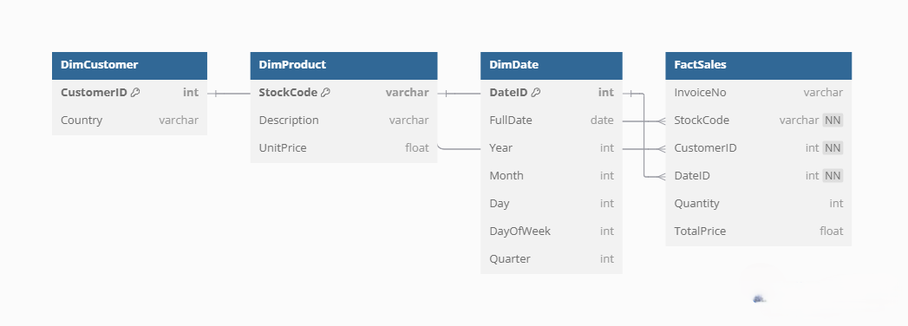

# Online Retail Data Warehouse Project

This project demonstrates the process of designing a star schema data warehouse using the Online Retail dataset.

## 📌 Dataset

Source: UCI Machine Learning Repository – Online Retail

## 🎯 Objective

Design a data warehouse for analytical queries on customer purchases using Star Schema.

## ⭐ Star Schema Design

**Fact Table:**
- `FactSales`: Tracks transactions with InvoiceNo, CustomerID, StockCode, DateID, Quantity and TotalPrice.

**Dimension Tables:**
- `DimCustomer`: CustomerID, Country
- `DimProduct`: StockCode, Description, UnitPrice
- `DimDate`: DateID, FullDate, Year, Month, Day, DayOfWeek, Quarter

## 🧠 Technologies Used

- Python, Pandas
- SQL (DDL)
- Jupyter Notebook

## 🛠️ What’s Done

- ✅ Data cleaning and transformation in pandas
- ✅ Designed Dim and Fact tables
- ✅ Wrote SQL DDLs for schema creation

## 📂 Folder Structure

- `notebooks/`: All Jupyter notebooks
- `schema/`: SQL DDL statements
- `data/`: Sample data 
- `images/`: Diagrams or screenshots
- `cleaned/`: cleaned data

## 🧠 Next Steps (Azure Deployment)

- Set up Azure SQL Database
- Load data using SQLAlchemy
- Write analytical SQL queries

